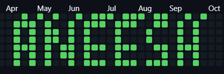

<div align="center">

# 🎨 GitGraffiti

### Transform Your GitHub Profile Into Art

*Paint your contribution graph with custom patterns, pixel art, and stunning visual designs*

[](https://opensource.org/licenses/MIT)
[](https://nodejs.org/)
[](https://github.com/AneeshVRao/GitGraffiti)

[Features](#-features) • [Quick Start](#-quick-start) • [Examples](#-examples) • [Documentation](#-documentation)

</div>

---

## 📸 Showcase

<div align="center">

### My Contribution Graph Art



*"ANEESH" painted on my 2024 contribution graph using GitGraffiti*

> 💡 **Want to add your own?** Take a screenshot of your GitHub profile's contribution section and add it here!

</div>

---

## 🌟 Why GitGraffiti?

GitGraffiti turns your GitHub contribution graph into a creative canvas. Whether you want to spell out your name, draw patterns, or create pixel art, this tool makes it simple and fun!

## ✨ Features

| Feature | Description |
|---------|-------------|
| 🎲 **Random Mode** | Fill your graph with randomized commits for a natural look |
| 🎨 **Pattern Library** | 8+ pre-built patterns including hearts, smiles, waves, and mountains |
| ✍️ **Text Drawing** | Spell out any text with built-in pixel font (A-Z supported) |
| 🎯 **Custom Designs** | Create your own patterns using coordinate arrays |
| 🎚️ **Intensity Control** | Adjust commit density to control green shade (1-10 levels) |
| 📅 **Date Targeting** | Target specific years or date ranges with precision |
| 🔍 **Safe Preview** | Visualize patterns before creating any commits |
| 🩹 **Patch Mode** | Fine-tune and fix individual pixels after creation |
| 🚀 **Zero Config** | Works out-of-the-box with sensible defaults |

## 🚀 Quick Start

### 1. Clone the Repository

```bash
git clone https://github.com/AneeshVRao/GitGraffiti.git
cd GitGraffiti
```

### 2. Install Dependencies

```bash
npm install
```

### 3. Configure Your Pattern

Edit `config.js` to customize your contribution graph:

```javascript
export const config = {
  mode: "pattern", // Options: 'random', 'pattern', 'custom'

  pattern: {
    name: "heart", // Choose your pattern
    intensity: 3, // Commits per cell (1-10)
    startWeek: 10, // Starting position
  },
};
```

### 4. Preview Before Running (Recommended!)

```bash
npm run preview
# or
npm test
```

This shows you a visual preview of your pattern without creating commits!

### 5. Run the Script

```bash
npm start
# or
node index.js
```

## 🧪 Testing

**⚠️ IMPORTANT: Always test on a separate repository first!**

See [TESTING.md](TESTING.md) for comprehensive testing guide.

### Quick Test

1. **Preview your pattern:**

   ```bash
   npm run preview
   ```

2. **Check the output:**

   - Visual grid preview
   - Commit statistics
   - Git status verification

3. **Test on a separate repo:**
   - Create a test repository on GitHub
   - Clone and set it up with GitGraffiti
   - Run with small settings (see `config.test.js`)

## 📋 Available Modes

### 🎲 Random Mode

Fill your contribution graph with random commits across the year.

```javascript
mode: 'random',
random: {
  numberOfCommits: 100,  // Total commits to make
  commitsPerDay: 1,      // Commits per day (1-10)
}
```

### 🎨 Pattern Mode

Choose from predefined patterns:

| Pattern     | Description          |
| ----------- | -------------------- |
| `heart`     | ❤️ Heart shape       |
| `smile`     | 😊 Smiley face       |
| `wave`      | 🌊 Sine wave pattern |
| `mountain`  | ⛰️ Mountain range    |
| `cross`     | ➕ Cross/Plus shape  |
| `checkmark` | ✓ Checkmark          |
| `diagonal`  | 📐 Diagonal stripes  |
| `name`      | ✍️ Spell out text    |

```javascript
mode: 'pattern',
pattern: {
  name: 'heart',        // Pattern name
  intensity: 3,         // Darkness (1-10)
  startWeek: 10,       // Horizontal position
  text: 'HI',          // For 'name' pattern only
}
```

### 🎯 Custom Mode

Create your own pattern using coordinates:

```javascript
mode: 'custom',
custom: {
  coordinates: [
    [5, 0], [5, 1], [5, 2],  // [week, day]
    [10, 3],                   // Week: 0-52, Day: 0-6
    [15, 0], [15, 6],         // Sunday = 0
  ],
  intensity: 2,
}
```

## ⚙️ Configuration Options

### Date Range

```javascript
dateRange: {
  startDaysAgo: 365,  // Start from 1 year ago
  endDaysAgo: 0,      // End today (0) or future (negative)
}
```

### Advanced Settings

```javascript
dataFile: './data.json',     // Data file location
commitDelay: 100,             // Delay between commits (ms)
verbose: true,                // Show detailed logs
```

## 📖 Examples

### Example 1: Spell Your Name 💚

Perfect for personalizing your profile!

```javascript
mode: 'pattern',
pattern: {
  name: 'name',
  text: 'ANEESH',      // Your name
  intensity: 4,         // Medium-bright green
  startWeek: 10,        // Centered position
}
dateRange: {
  startDaysAgo: 365,   // Covers full year
}
```

**Use Case:** Professional profiles, personal branding

---

### Example 2: Heart Pattern ❤️

Show some love on your profile!

```javascript
mode: 'pattern',
pattern: {
  name: 'heart',
  intensity: 5,         // Bright green
  startWeek: 20,        // Mid-year placement
}
```

**Use Case:** Valentine's Day, creative expression

---

### Example 3: Random Natural Fill 🌿

Create an organic, active-looking contribution graph:

```javascript
mode: 'random',
random: {
  numberOfCommits: 200,  // Moderate activity
  commitsPerDay: 2,      // Natural variation
}
dateRange: {
  startDaysAgo: 365,
}
```

**Use Case:** Making profiles look consistently active

---

### Example 4: Wave Pattern 🌊

Artistic and eye-catching:

```javascript
mode: 'pattern',
pattern: {
  name: 'wave',
  intensity: 3,
  startWeek: 0,         // Start from beginning
}
```

**Use Case:** Unique visual appeal, standing out

---

### Example 5: Custom Pixel Art 🎮

Create your own designs:

```javascript
mode: 'custom',
custom: {
  coordinates: [
    // Draw a simple arrow →
    [10, 3],
    [11, 3],
    [12, 3],
    [13, 3],
    [13, 2],
    [13, 4],
    [14, 1],
    [14, 5],
  ],
  intensity: 4,
}
```

**Use Case:** Unique designs, logos, symbols

---

### Example 6: Target Specific Year 📅

Create patterns for past years (great for 2024!):

```javascript
mode: 'pattern',
pattern: {
  name: 'name',
  text: 'CODE',
  intensity: 3,
  startWeek: 15,
}
dateRange: {
  startDaysAgo: 699,    // Jan 1, 2024
  endDaysAgo: 334,      // Dec 31, 2024
}
```

**Use Case:** Historical contributions, year-specific designs

## 🎨 Creating Custom Patterns

The contribution graph is a 52×7 grid (52 weeks × 7 days). To create custom patterns:

1. Plan your design on graph paper
2. Map coordinates as `[week, day]` where:
   - Week: 0-51 (columns, left to right)
   - Day: 0-6 (rows, Sunday to Saturday)
3. Add coordinates to `config.custom.coordinates`

**Example - Vertical Line:**

```javascript
coordinates: [
  [10, 0],
  [10, 1],
  [10, 2],
  [10, 3],
  [10, 4],
  [10, 5],
  [10, 6],
];
```

## ⚠️ Important Notes

- **Use on a separate repository**: Don't run this on your main projects
- **GitHub ToS**: This is for educational purposes - use responsibly
- **Backup**: Always backup your repo before running
- **Testing**: **ALWAYS run `npm run preview` first!** See [TESTING.md](TESTING.md)
- **Push manually**: The script auto-pushes; ensure your remote is correct
- **Test repository**: Create a separate test repo before using on your profile

## 🎯 Quick Commands

```bash
# Preview pattern (safe, no commits)
npm run preview

# Run the actual script
npm start

# Run patch script for touch-ups
npm run patch

# View test configuration
cat config.test.js
```

## 🩹 Patch Mode

After creating your pattern, you can fine-tune specific pixels using the patch script:

1. **Edit `patch.js`** - Add the dates you want to fill
2. **Run the patch**: `npm run patch`
3. **Automatic push** - Changes are pushed to GitHub

Perfect for:
- Fixing missing pixels in letters
- Smoothing curves
- Adjusting letter strokes
- Adding final touches

## 📂 Project Structure

```
GitGraffiti/
├── index.js           # Main script
├── config.js          # Configuration file
├── config.test.js     # Test configuration
├── patterns.js        # Pattern library
├── test.js            # Preview/test script
├── patch.js           # Fine-tuning script
├── data.json          # Commit data storage
├── package.json       # Dependencies
├── README.md          # Documentation
└── TESTING.md         # Testing guide
```

## 🛠️ Tech Stack

- **[Node.js](https://nodejs.org/)** - Runtime environment
- **[moment](https://www.npmjs.com/package/moment)** - Date manipulation
- **[simple-git](https://www.npmjs.com/package/simple-git)** - Git operations
- **[jsonfile](https://www.npmjs.com/package/jsonfile)** - JSON file handling
- **[random](https://www.npmjs.com/package/random)** - Random number generation

## 🤝 Contributing

Contributions are welcome! Here's how you can help:

1. 🍴 Fork the repository
2. 🌿 Create a feature branch (`git checkout -b feature/AmazingFeature`)
3. 💾 Commit your changes (`git commit -m 'Add some AmazingFeature'`)
4. 📤 Push to the branch (`git push origin feature/AmazingFeature`)
5. 🔃 Open a Pull Request

**Ideas for contributions:**
- New pattern designs
- Additional letter fonts
- Color intensity algorithms
- CLI interface
- Pattern import/export
- Animation support

## 📄 License

This project is licensed under the MIT License - see the [LICENSE](LICENSE) file for details.

## 👨‍💻 Author

**Aneesh V Rao**
- GitHub: [@AneeshVRao](https://github.com/AneeshVRao)
- Project: [GitGraffiti](https://github.com/AneeshVRao/GitGraffiti)

## 🙏 Acknowledgments

- Inspired by the original concept from [Akshay Saini](https://github.com/akshaymarch7)
- Motivated by [Fenrir's amazing tutorial](https://www.youtube.com/@Fenrir26) that sparked this journey
- Thanks to the open-source community for the amazing tools
- Special thanks to everyone who stars and uses this project!

## ⭐ Show Your Support

If you found this project helpful or interesting, please consider:
- ⭐ Starring the repository
- 🍴 Forking it for your own use
- 📢 Sharing it with others
- 🐛 Reporting bugs or suggesting features

---

<div align="center">

### 🎨 Make Your GitHub Profile Stand Out!

**[Get Started](#-quick-start)** • **[View Examples](#-examples)** • **[Read Docs](#-documentation)**

⚠️ **Disclaimer:** This project is for educational and creative purposes. Please use responsibly and be mindful of GitHub's Terms of Service.

Made with ❤️ by [Aneesh V Rao](https://github.com/AneeshVRao)

</div>
